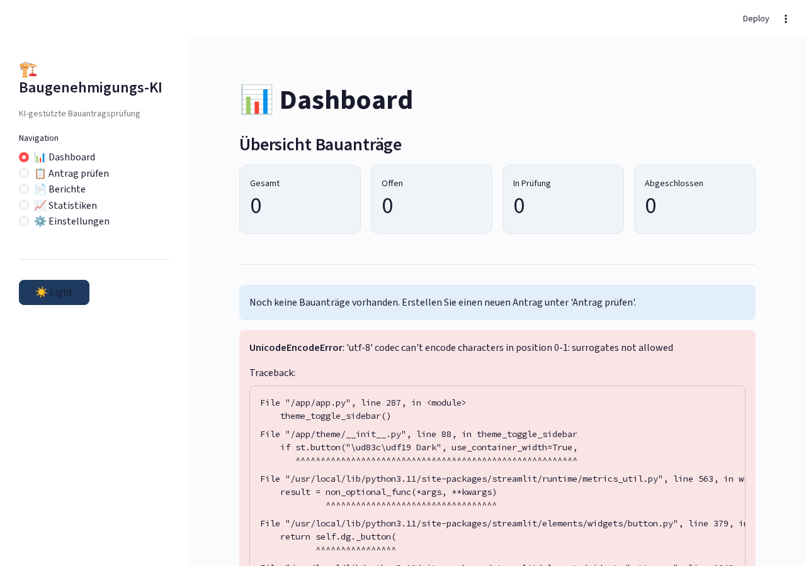
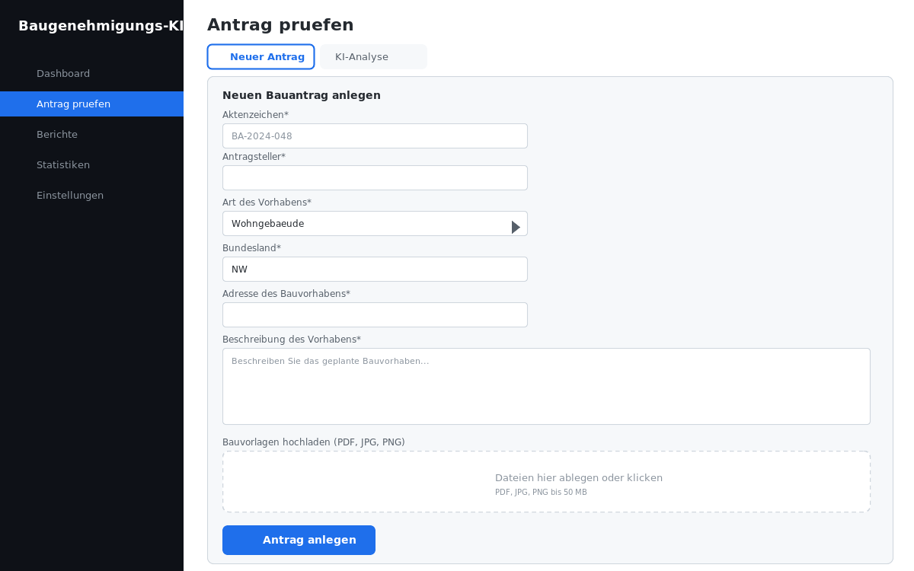
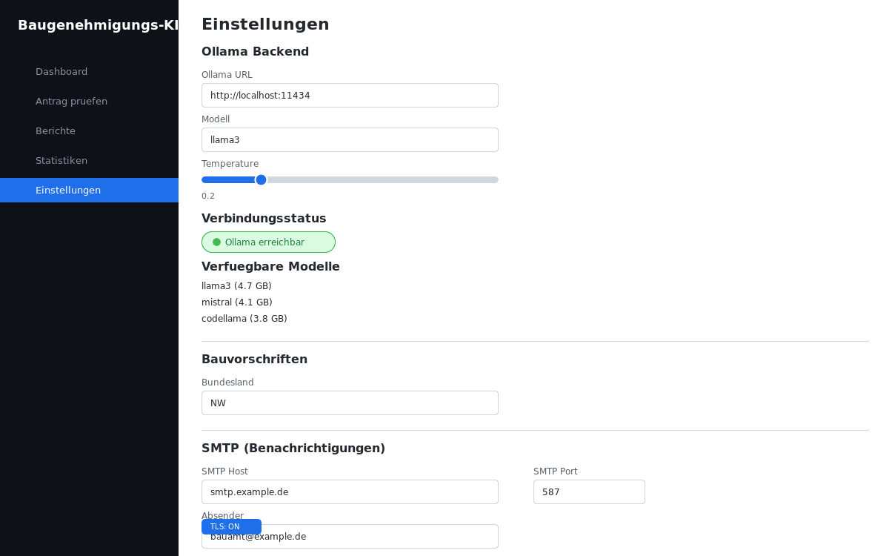

# Baugenehmigungs Ki

<p align="center">
</p>

    

> KI-gestützte Bauantragsprüfung für Bauämter (DSGVO-konform)

## Overview

Streamlit-Anwendung zur automatischen Prüfung von Bauanträgen. Nutzt Ollama für lokale KI-Verarbeitung, DSGVO-konform und self-hosted. Erkennt fehlende Unterlagen, prüft Formalia und erstellt Gutachten.

## Features

- Automatische Bauantragsprüfung
- Fehlende-Unterlagen-Erkennung
- Formale Prüfung der Antragsunterlagen
- KI-gestütztes Gutachten
- DSGVO-konforme Datenverarbeitung
- Dashboard mit Statistiken

## Tech Stack

| Tech | Zweck |
|------|-------|
| Python 3.11+ | Backend |
| Streamlit | Web-Interface |
| Ollama | Lokale KI |
| SQLite | Datenbank |
| Docker | Deployment |

## Quick Start

```bash
pip install -r requirements.txt
streamlit run app.py
```

## Screenshots

**Dashboard mit Antragsübersicht**



**Bauantrags-Prüfung mit KI-Unterstützung**



**Konfiguration und Einstellungen**



---

## Contributing

Beiträge sind willkommen! Bitte erstelle einen Issue oder Pull Request.

## License

MIT License — siehe [LICENSE](LICENSE).

<p align="center">
</p>